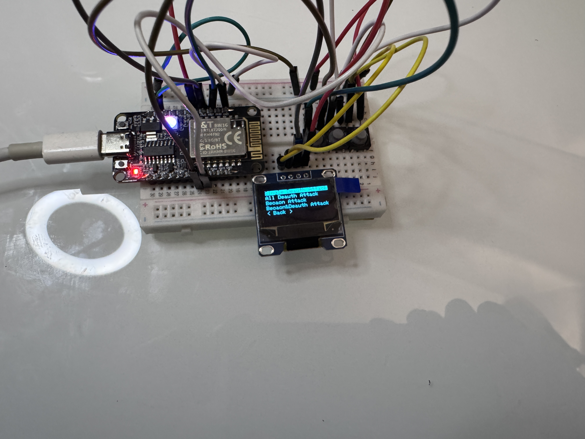
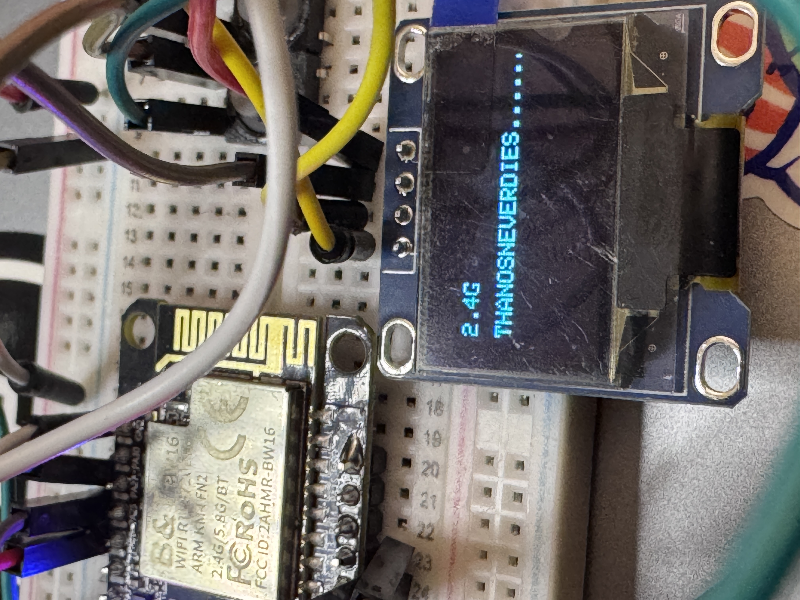
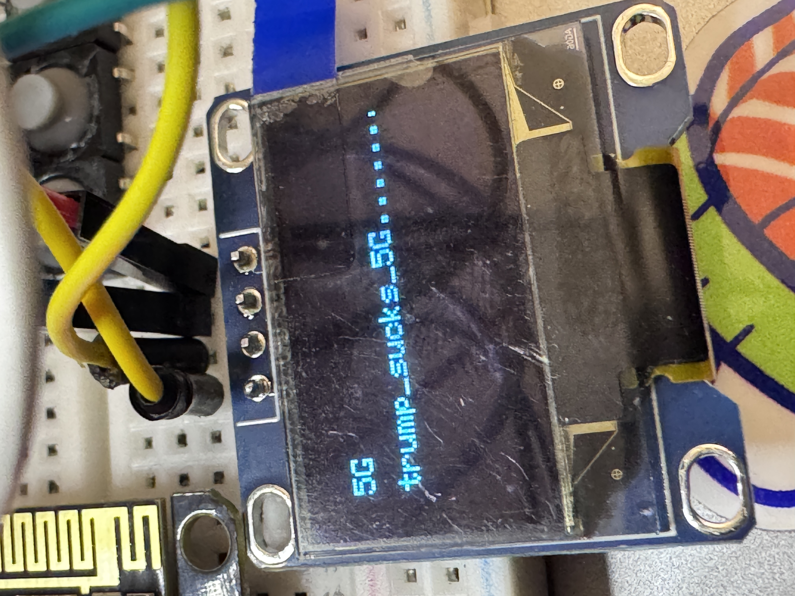
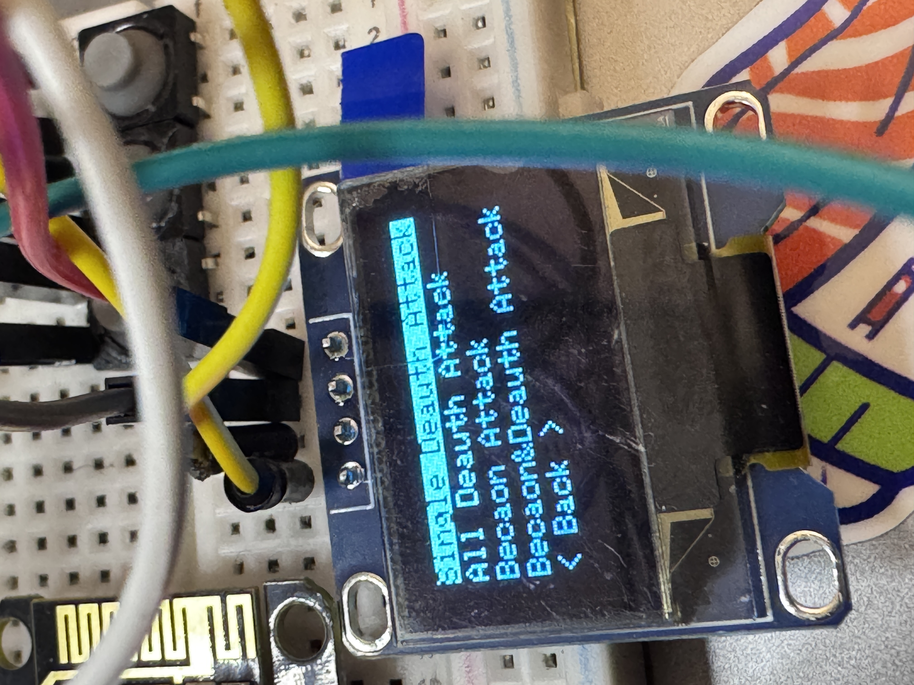
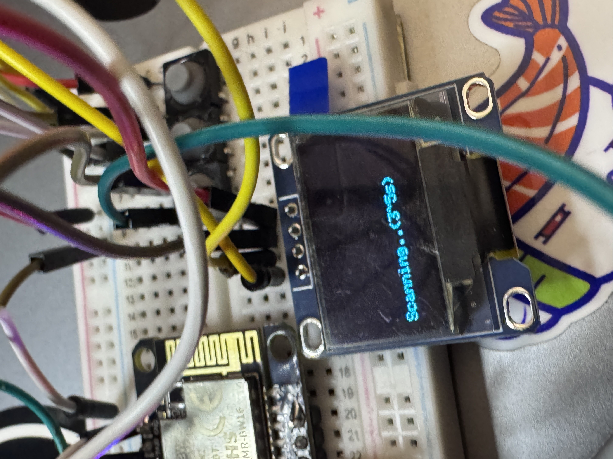
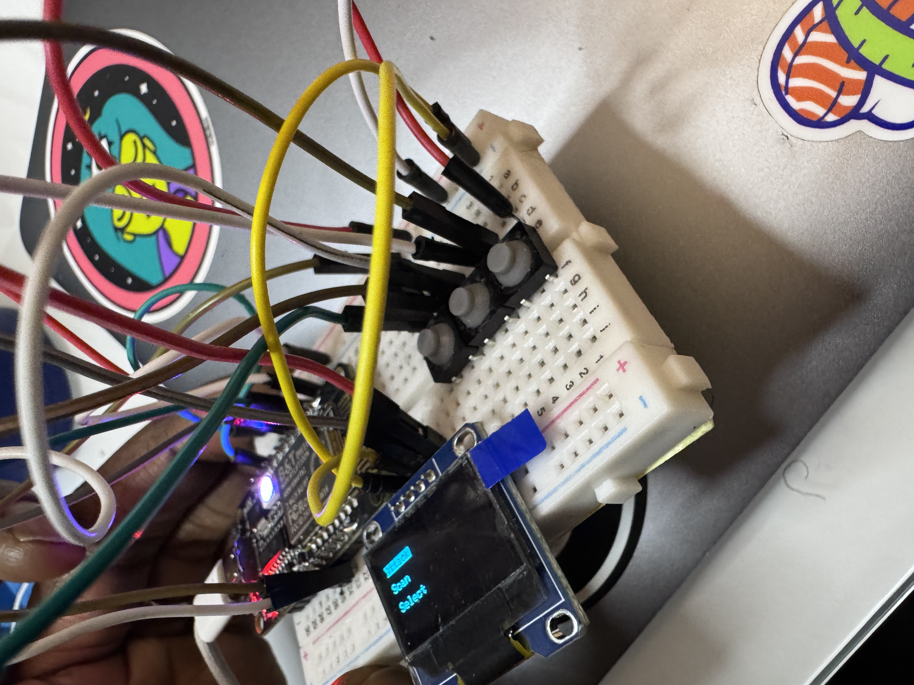
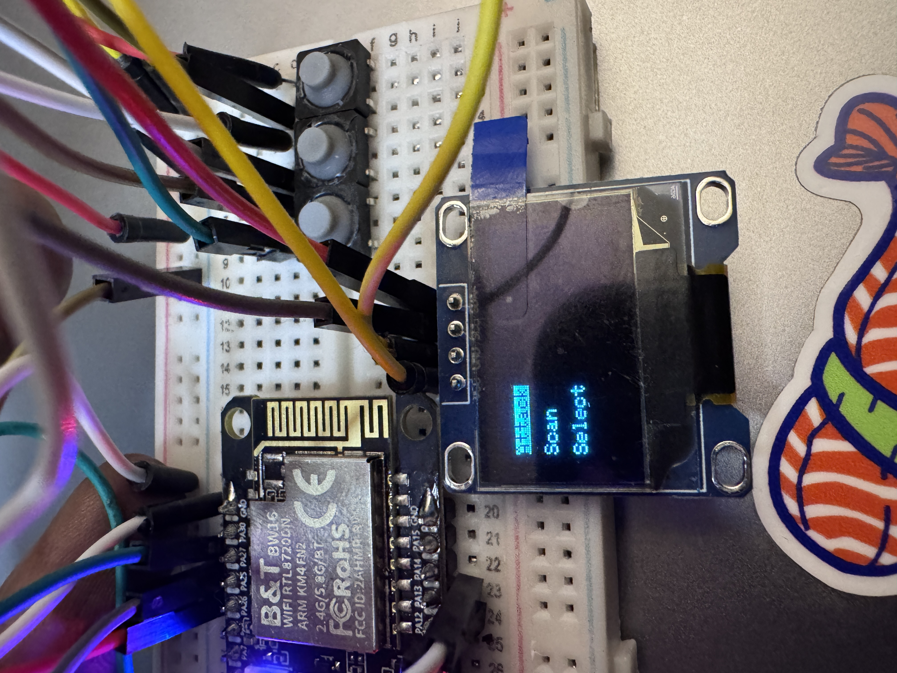
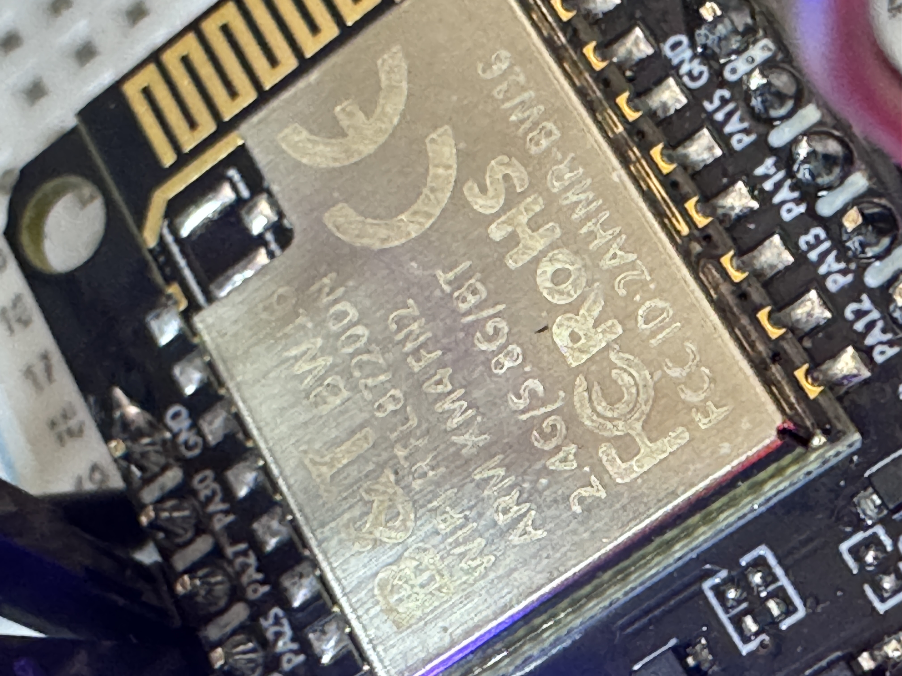
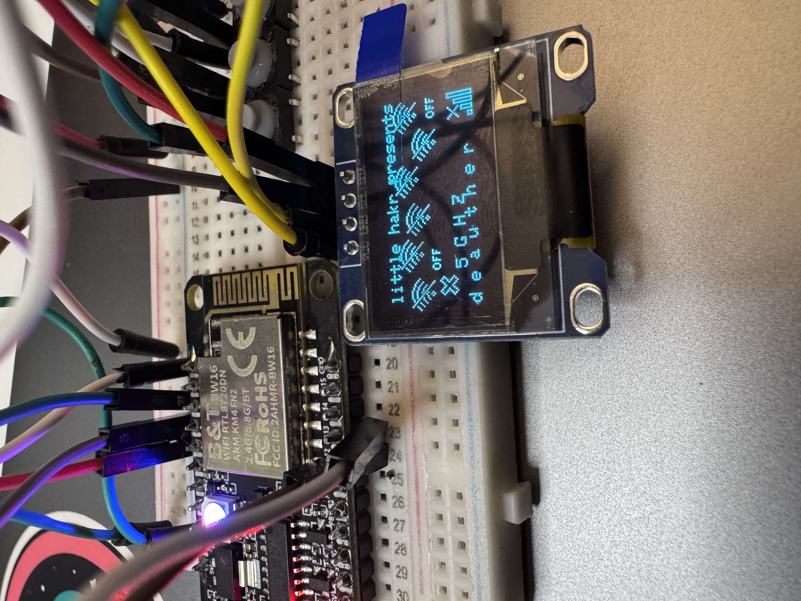

# Cypher 5G Deauther

Original Project
[Link](https://github.com/tesa-klebeband/RTL8720dn-Deauther)

## Main Changes
I wanted to develop on a portable device that had 2.4ghz but also 5ghz deauthing features. The BW16 isnt compatible with Adafruit SSD1306 libraries without modifications, so adding a screen was difficult. I found a project by Warwick, however I do not like when developers add .bins or their own "upload image tool/flashers"....also don't like when you can't edit the code. Not very "open-source".

So i added the Adafruit SSD1306 fix, so now anyone can easliy edit the code and work with the display for you own projects involving BW16!

CUSTOM PCB FILES SOON!

Hope to soon add Evil Twin and more???

## How to Upload Firmware / Usage

1) Go to RTL8720DN_SSD1306_FIX folder. You need to first backup any files that will be replaced, and then add this into your Arduino/libraries folder.
    - This fixes bugs that make Adafruit SSD1306 library incompatible with BW16 board.
2) Upload the firmware using the .ino file via Arduino IDE.
3) Turn it on and select/attack!
4) You can also connect to web ui (change credentials in code)
    wifi= littlehakr
    pw= 0123456789

## Requirements

- SSD1306
- 3 Buttons
- BW16 Board (DO NOT BUY BW16E, WILL NOT WORK!!!)

## PICTURES

## Connections

### Buttons
- **Up Button**: PA27  
- **Down Button**: PA12  
- **Select Button**: PA13  

### SSD1306 128x64 .96inch Display
- **SDA**: PA26  
- **SCL**: PA25  
